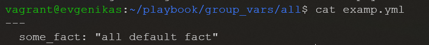

# Самоконтроль выполненения задания

1. Где расположен файл с `some_fact` из второго пункта задания?

2. Какая команда нужна для запуска вашего `playbook` на окружении `test.yml`?
```shell
ansible-playbook site.yml -i inventory/test.yml
```
3. Какой командой можно зашифровать файл?
```shell
ansible-vault encrypt 'путь к файлу'
```
4. Какой командой можно расшифровать файл?
```shell
ansible-vault decrypt 'путь к файлу'
```
5. Можно ли посмотреть содержимое зашифрованного файла без команды расшифровки файла? Если можно, то как?
```shell
ansible-vault view 'путь к файлу'
```
6. Как выглядит команда запуска `playbook`, если переменные зашифрованы?
```shell
ansible-playbook -i 'путь к файлу' 'имя файла' --ask-vault-pass
```
7. Как называется модуль подключения к host на windows?
* psrp
8. Приведите полный текст команды для поиска информации в документации ansible для модуля подключений ssh
```shell
ansible-doc -t connection ssh
```
9. Какой параметр из модуля подключения `ssh` необходим для того, чтобы определить пользователя, под которым необходимо совершать подключение?
* ansible_user
