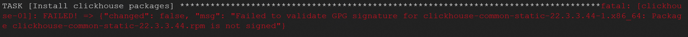

# Домашнее задание к занятию "08.02 Работа с Playbook"

## Подготовка к выполнению

1. (Необязательно) Изучите, что такое [clickhouse](https://www.youtube.com/watch?v=fjTNS2zkeBs) и [vector](https://www.youtube.com/watch?v=CgEhyffisLY)
2. Создайте свой собственный (или используйте старый) публичный репозиторий на github с произвольным именем.
3. Скачайте [playbook](./playbook/) из репозитория с домашним заданием и перенесите его в свой репозиторий. 
4. Подготовьте хосты в соответствии с группами из предподготовленного playbook.
Пытаюсь запустить плэйбук на докер контейнере

```shell
- name: Install Clickhouse
  hosts: clickhouse
  handlers:
    - name: Start clickhouse service
      become: true
      ansible.builtin.service:
        name: clickhouse-server
        state: restarted
  tasks:
    - block:
        - name: Get clickhouse distrib
          ansible.builtin.get_url:
            url: "https://packages.clickhouse.com/rpm/stable/{{ item }}-{{ clickhouse_version }}.noarch.rpm"
            dest: "./{{ item }}-{{ clickhouse_version }}.rpm"
          with_items: "{{ clickhouse_packages }}"
      rescue:
        - name: Get clickhouse distrib
          ansible.builtin.get_url:
            url: "https://packages.clickhouse.com/rpm/stable/clickhouse-common-static-{{ clickhouse_version }}.x86_64.rpm"
            dest: "./clickhouse-common-static-{{ clickhouse_version }}.rpm"
    - name: GPG
      become: true
      ansible.builtin.yum:
      disable_gpg_check: "{{ disable_yum_gpg_check | d(omit) }}"
    - name: Install clickhouse packages
      become: true
      become_method: su
      ansible.builtin.yum:
        name:
          - clickhouse-common-static-{{ clickhouse_version }}.rpm
          - clickhouse-client-{{ clickhouse_version }}.rpm
          - clickhouse-server-{{ clickhouse_version }}.rpm
```
Так у меня не запускается плэйбук, ошибка синтаксиса
Я отключала вручную в докер контейнере gpg_check=0, но это не помогло
Я попробовала поднять виртуалку на центосе также в вагрант и она также на локалхосте и подключиться к ней по ssh не получается, вместо этого он мне на убунту грузит кликхаус.
Я пробовала через wmvare запустить виртуалку, но там тоже ничего не получается.
В общем помогите мне, пожалуйста. 
## Основная часть

1. Приготовьте свой собственный inventory файл `prod.yml`.
2. Допишите playbook: нужно сделать ещё один play, который устанавливает и настраивает [vector](https://vector.dev).
3. При создании tasks рекомендую использовать модули: `get_url`, `template`, `unarchive`, `file`.
4. Tasks должны: скачать нужной версии дистрибутив, выполнить распаковку в выбранную директорию, установить vector.
5. Запустите `ansible-lint site.yml` и исправьте ошибки, если они есть.
6. Попробуйте запустить playbook на этом окружении с флагом `--check`.
7. Запустите playbook на `prod.yml` окружении с флагом `--diff`. Убедитесь, что изменения на системе произведены.
8. Повторно запустите playbook с флагом `--diff` и убедитесь, что playbook идемпотентен.
9. Подготовьте README.md файл по своему playbook. В нём должно быть описано: что делает playbook, какие у него есть параметры и теги.
10. Готовый playbook выложите в свой репозиторий, поставьте тег `08-ansible-02-playbook` на фиксирующий коммит, в ответ предоставьте ссылку на него.

---

### Как оформить ДЗ?

Выполненное домашнее задание пришлите ссылкой на .md-файл в вашем репозитории.

---
