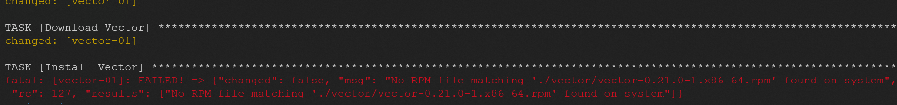
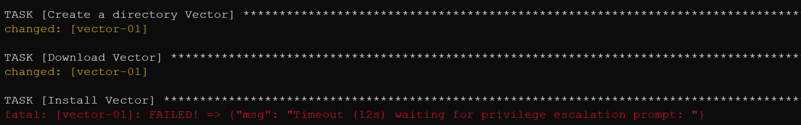

# Домашнее задание к занятию "08.03 Использование Yandex Cloud"

## Подготовка к выполнению

1. (Необязательно) Познакомтесь с [lighthouse](https://youtu.be/ymlrNlaHzIY?t=929)
2. Подготовьте в Yandex Cloud три хоста: для `clickhouse`, для `vector` и для `lighthouse`.

Ссылка на репозиторий LightHouse: https://github.com/VKCOM/lighthouse

У меня проблема еще на этапе установки Вектора, хотя в докере все работало. Файл скачивается, но ansible его не видит



```shell
- name: Install Vector
  hosts: vector
  tasks:
    - name: Create a directory Vector
      ansible.builtin.file: path=/vector state=directory mode=0755
    - name: Download Vector
      ansible.builtin.get_url:
        url: "https://packages.timber.io/vector/0.21.0/vector-0.21.0-1.x86_64.rpm"
        dest: "./vector/vector-0.21.0-1.x86_64.rpm"
        mode: 0664
        timeout: 200
    - name: Install Vector
      become: true
      become_method: su
      become_exe: sudo su -
      ansible.builtin.yum:
        disable_gpg_check: true
        name: "./vector/vector-0.21.0-1.x86_64.rpm"
```
Если убираю параметр become_exe: sudo su - то тогда ошибка с привилегиями:

## Основная часть

1. Допишите playbook: нужно сделать ещё один play, который устанавливает и настраивает lighthouse.
2. При создании tasks рекомендую использовать модули: `get_url`, `template`, `yum`, `apt`.
3. Tasks должны: скачать статику lighthouse, установить nginx или любой другой webserver, настроить его конфиг для открытия lighthouse, запустить webserver.
4. Приготовьте свой собственный inventory файл `prod.yml`.
5. Запустите `ansible-lint site.yml` и исправьте ошибки, если они есть.
6. Попробуйте запустить playbook на этом окружении с флагом `--check`.
7. Запустите playbook на `prod.yml` окружении с флагом `--diff`. Убедитесь, что изменения на системе произведены.
8. Повторно запустите playbook с флагом `--diff` и убедитесь, что playbook идемпотентен.
9. Подготовьте README.md файл по своему playbook. В нём должно быть описано: что делает playbook, какие у него есть параметры и теги.
10. Готовый playbook выложите в свой репозиторий, поставьте тег `08-ansible-03-yandex` на фиксирующий коммит, в ответ предоставьте ссылку на него.

---

### Как оформить ДЗ?

Выполненное домашнее задание пришлите ссылкой на .md-файл в вашем репозитории.

---
