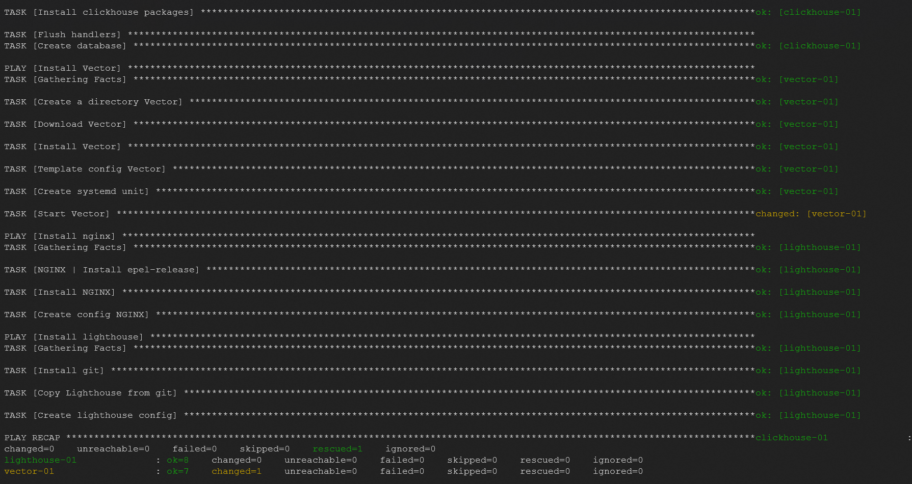

# Домашнее задание к занятию "08.03 Использование Yandex Cloud"

`
Playbook установит на разных ВМ по приложению из списка:

App  | Version  | IP  | distributions |
-------  | --------  | -------  | -------- |
Clickhouse  | 22.3.3.44 | 51.250.105.82  | rpm  |
Lighthouse (+nginx)  |  | 51.250.23.193  | GitHub  |
Vector  | 0.21.0  | 158.160.18.249  | rpm  |

** Параметры: 

- IP-хостов задаются в файле инвентаризации prod.yml;
- Чтобы открыть lighthouse на хосте вместе с ним будет запущен веб-сервер nginx

Шаблон "nginx.conf.j2" используется для первичной настройки nginx. 
Мы задаем пользователя для работы nginx и удаляем настройки root директории по умолчанию.

Шаблон "lighthouse.conf.j2" настраивает nginx на работу с lighthouse. 
В нем прописываем порт 80, root директорию и index страницу.

** Теги:
clickhouse - установка и запуск Clickhouse
lighthouse - установка Lighthouse
nginx - установка epel, NGINX и создание конфига
vector - установка Vector, создание конфига, запуск

