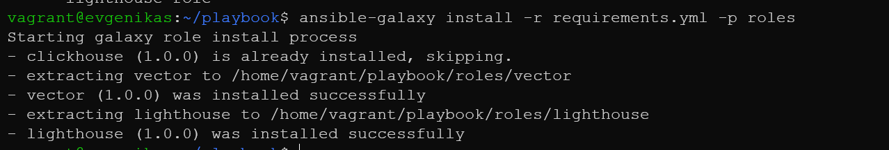
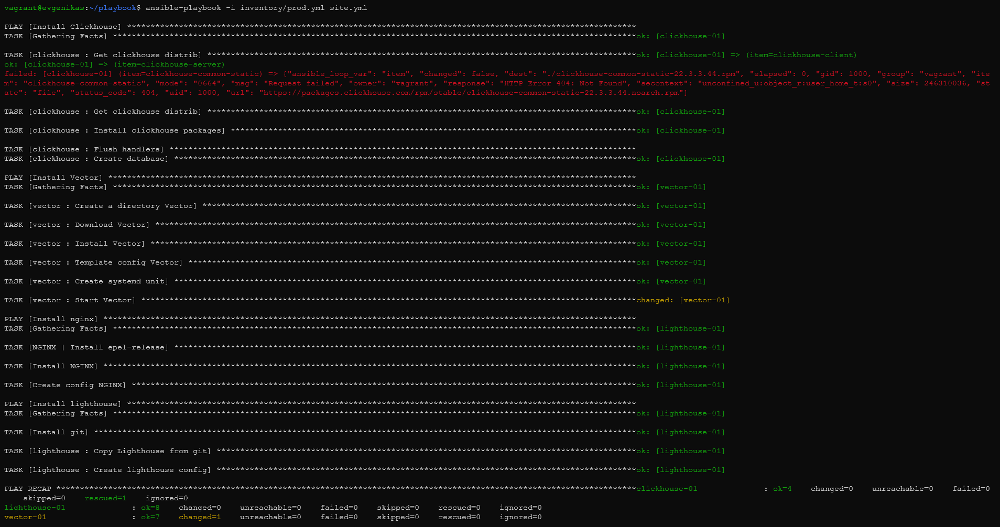

# Домашнее задание к занятию "08.04. Работа с Roles"

 

* [Playbook](https://github.com/EvgeniyaAvdeeva/playbook_8.4)
* [clickhouse-role](https://github.com/EvgeniyaAvdeeva/clickhouse-role)
* [vector-role](https://github.com/EvgeniyaAvdeeva/vector-role)
* [lighthouse-role](https://github.com/EvgeniyaAvdeeva/lighthouse-role)

|                           | [vector-role](https://github.com/EvgeniyaAvdeeva/vector-role)            | [lighthouse-role](https://github.com/EvgeniyaAvdeeva/lighthouse-role)                                                                                                                                                       |
|---------------------------|:-------------------------------------------------------------------------|:----------------------------------------------------------------------------------------------------------------------------------------------------------------------------------------------------------------------------|
| Role Name                 | Downloads the rpm file and install Vector.                               | Copies Lighthouse from the Git repository and installs                                                                                                                                                                      |
| Preliminary requirements  | Distribution linux: Centos7                                              | Distribution linux: Centos7                                                                                                                                                                                                 |
| Role Variables            | In the file defaults/main.yml:  - vector_version: "0.21.0"           | In the file vars/main.yml: - lighthouse_vcs: https://github.com/VKCOM/lighthouse.git   - lighthouse_access_log_name: lighthouse_access - lighthouse_location_dir: ~/home/lighthouse nginx_user_name: "root" |
| Dependencies              | There are no dependencies                                                | First you need to install epel-release, download nginx and install git                                                                                                                                                      |
| Example Playbook          | - name: Install Vector  hosts: vector  roles:  - vector-role | - name: Install Lighthouse  hosts: lighthouse  roles:  - lighthouse-role                                                                                                                                        |
| License                   | Free                                                                     | Free                                                                                                                                                                                                                        |
| Author Information        | Evgeniya Avdeeva                                                         | Evgeniya Avdeeva                                                                                                                                                                                                            |

  
  
    

---

